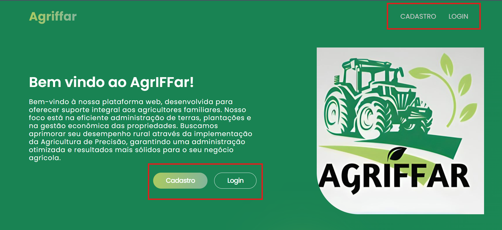
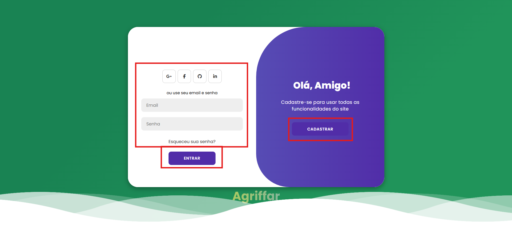

<a id="readme-top"></a>
<div align="center">

  [![MIT License][license-shield]][license-url]
  [![LinkedIn][linkedin-shield]][linkedin-url]
  [](https://wakatime.com/badge/github/dornelesfernando/AgrIFFar)
</div>

<a href="https://github.com/dornelesfernando/AgrIFFar/blob/main/README_pt-BR.md">

  > [!TIP]
  > Clique aqui para ler esse `README.md`  em **português**.
</a>

<h4 align="center"> 
	🚧  Under Construction...  🚧
</h4>

<!-- PROJECT LOGO -->
<br />
<div align="center">
  <a href="https://github.com/dornelesfernando/AgrIFFar">
    
  </a>

  <h3 align="center">AgrIFFar - Application for Management of Small Rural Properties</h3>

  <p align="center">
    Helping those who feed the world!
    <br />
    <a href="https://github.com/dornelesfernando/AgrIFFar"><strong>Explore the docs »</strong></a>
    <br />
    <br />
    <a href="https://agriffar.vercel.app">View Demo</a>
    ·
    <a href="https://github.com/dornelesfernando/AgrIFFar/issues/new?labels=bug&template=bug_report.md">Report Bug</a>
    ·
    <a href="https://github.com/dornelesfernando/AgrIFFar/issues/new?labels=enhancement&template=feature_request.md">Request Feature</a>
    
  </p>
</div>

> [!NOTE]
> To use all features, download this repository to your development environment.

<!-- TABLE OF CONTENTS -->
<details>
  <summary>Table of Contents</summary>
  <ol>
    <li>
      <a href="#about-the-project">About The Project</a>
      <ul>
        <li><a href="#built-with">Built With</a></li>
      </ul>
    </li>
    <li>
      <a href="#getting-started">Getting Started</a>
      <ul>
        <li><a href="#prerequisites">Prerequisites</a></li>
        <li><a href="#installation">Installation</a></li>
      </ul>
    </li>
    <li><a href="#usage">Usage</a></li>
    <li><a href="#roadmap">Roadmap</a></li>
    <li><a href="#roadmap">Roadmap Pages</a></li>
    <li><a href="#license">License</a></li>
    <li><a href="#contact">Contact</a></li>
    <li><a href="#acknowledgments">Acknowledgments</a></li>
  </ol>
</details>


<!-- ABOUT THE PROJECT -->
<a id="#about-the-project"></a>

## About The Project ✨ 

[![Home Page Screen Shot][product-screenshot]](https://agriffar.vercel.app/)

### Objective 🎯
The AgrIFFar is an innovative solution designed to meet the needs of small rural properties, providing support for agricultural management and access to precision farming technologies at an affordable cost.

### Benefits 🌱
- Offer small producers a practical and efficient tool. 
- Monitoring activities on their farms.
- Decision-making
- Optimizing the use of natural resources.
- Reducing waste.
- Increasing productivity in a sustainable way.

### Development 🚜
Developed by students from the Federal Institute of Education, Science, and Technology Farroupilha - Santo Ângelo Campus, under the coordination of Karlise Soares Nascimento, AgrIFFar reflects the institution's commitment to innovation and regional development.

<p align="right">(<a href="#readme-top">back to top</a>)</p>


<!-- BUILT WITH> -->
<a id="#built-with"></a>

### Built With 🛠️

List of major tools used in the project.

* [![React][React.js]][React-url]
* [![Vite][Vite.js]][Vite-url]
* [![MySQL][MySQL.com]][MySQL-url]

<p align="right">(<a href="#readme-top">back to top</a>)</p>


<!-- GETTING STARTED -->
<a id="#getting-started"></a>

## Getting Started 🚀

To get a local copy up and running follow these simple example steps.

### Prerequisites 📋
  Make sure you have the following installed:

* **npm**  
  ```sh
  npm install npm@latest -g
  ```

### Installation ⚙️

_Follow the steps to install and configure your application. This template does not rely on any external dependencies or services._

1. Clone the repo
   ```sh
   git clone https://github.com/dornelesfernando/AgrIFFar.git
   ```
2. Install NPM packages
   ```sh
   npm install
   ```

3. Change git remote url to avoid accidental pushes to base project
   ```sh
   git remote set-url origin dornelesfernando/AgrIFFar
   git remote -v # confirm the changes
   ```

<p align="right">(<a href="#readme-top">back to top</a>)</p>


<!-- USAGE EXAMPLES -->
<a id="#usage"></a>

## Usage 🌟

### 1️⃣ **Register or Login**

The first step is to create an account or log in if you already have one. If you don't have an account, click on "Sign Up" and fill in your details. If you already have an account, click on "Log In" and enter your credentials.

**Print of the login or registration screen:**



---

### 2️⃣ **Fill in the registration details or log in**

- **Registration:** Fill in all the necessary fields to create a new account, such as name, email and password.
  
  **Print of the registration screen:**

  

- **Login:** Enter your email and password to access your existing account.

  **Print of the login screen:**

  

---

### 3️⃣ **Access the Dashboard**

After completing your registration or login, you will be directed to the **Dashboard**, where you can view and manage your information and data. Here you can access different features of the system in an easy and intuitive way.

**Printout of the released Dashboard:**


<p align="right">(<a href="#readme-top">back to top</a>)</p>

---

<!-- ROADMAP -->
<a id="#roadmap"></a>

## Roadmap 📍

- [ ] Add Changelog
- [ ] Add documentation for the project
- [ ] Add comment in project code
- [ ] Multi-language Support
    - [ ] English
    - [ ] Spanish
    - [ ] Chinese

See the [open issues](https://github.com/dornelesfernando/AgrIFFar/issues) for a full list of proposed features (and known issues).

<p align="right">(<a href="#readme-top">back to top</a>)</p>


<!-- ROADMAP PAGES -->
<a id="#roadmapPages"></a>

## Roadmap Pages 📌

<div align="right">
UT: User Type - 
  (🌐) Common - 
  (🛡️) Administrator - 
  (🧑‍🌾) Farmer 
</div>

| UT | Page                        | Status         | - | - | UT | Page                        | Status         |
|-----|-----------------------------|----------------| - | - |-----|-----------------------------|----------------|
| 🌐  | Dashboard                   | 🔲 In progress | - | - | 🧑‍🌾  | Crops by Field              | 🔲 Not started |
| 🌐  | Profile                     | 🔲 Not started | - | - | 🧑‍🌾  | Harvests by Field           | 🔲 Not started |
| 🌐  | Settings                    | 🔲 Not started | - | - | 🧑‍🌾  | Treatments                  | 🔲 Not started |
|-----|-----------------------------|----------------| - | - | 🧑‍🌾  | Cash Flow                   | 🔲 Not started |
| 🛡️  | Manage Users                | 🔲 Not started | - | - | 🧑‍🌾  | Costs                       | 🔲 Not started |
| 🛡️  | Overview                    | 🔲 Not started | - | - | 🧑‍🌾  | Depreciation                | 🔲 Not started |
| 🛡️  | Team                        | 🔲 Not started | - | - | 🧑‍🌾  | Inputs                      | 🔲 Not started |
| 🛡️  | Reports                     | 🔲 Not started | - | - | 🧑‍🌾  | Investments                 | 🔲 Not started |
| 🛡️  | Crops                       | 🔲 Not started | - | - | 🧑‍🌾  | Machinery                   | 🔲 Not started |
| 🛡️  | Fields                      | 🔲 Not started | - | - | 🧑‍🌾  | Maintenance                 | 🔲 Not started |
| 🛡️  | Tips                        | 🔲 Not started | - | - | 🧑‍🌾  | Planting                    | 🔲 Not started |
| 🛡️  | Recent Orders               | 🔲 Not started | - | - | 🧑‍🌾  | Preparation                 | 🔲 Not started |
|-----|-----------------------------|----------------| - | - | 🧑‍🌾  | Stock                       | 🔲 Not started |
| 🧑‍🌾  | My Crops                   | 🔲 Not started | - | - | 🧑‍🌾  | Tips                        | 🔲 Not started |
| 🧑‍🌾  | My Reports                 | 🔲 Not started | - | - | 🧑‍🌾  | Transportation              | 🔲 Not started |
| 🧑‍🌾  | My Fields                  | 🔲 In progress | - | - |-----|-----------------------------|----------------|

<p align="right">(<a href="#readme-top">back to top</a>)</p>


<!-- LICENSE -->
<a id="#license"></a>

## License 📝

Distributed under the MIT License. See `LICENSE` for more information.

<p align="right">(<a href="#readme-top">back to top</a>)</p>


<!-- CONTACT -->
<a id="#contact"></a>

## Contact 🌍

Fernando Dorneles - [Lattes](http://lattes.cnpq.br/0532418852427960) - [@fernandodorneles](www.linkedin.com/in/fernandodorneles) - fernandodorneles95@gmail.com

Karlise Soares - [Lattes](http://lattes.cnpq.br/6702586607871869) - karlise.nascimento@iffarroupilha.edu.br

Project Link: [https://github.com/dornelesfernando/AgrIFFar](https://github.com/dornelesfernando/AgrIFFar)

<p align="right">(<a href="#readme-top">back to top</a>)</p>


<!-- ACKNOWLEDGMENTS -->
<a id="#acknowledgments"></a>

## Acknowledgments 🤝

List of useful resources that I enjoyed using in the project:

* [Vercel](https://vercel.com/)
* [Learn React](https://react.dev/learn)
* [React Icons](https://react-icons.github.io/react-icons/search)
* [W3Schools Online Web Tutorials](https://www.w3schools.com/)
* [MDN Web Docs - Mozilla](https://developer.mozilla.org/)
* [Font Awesome](https://fontawesome.com)

<p align="right">(<a href="#readme-top">back to top</a>)</p>

<!-- MARKDOWN LINKS & IMAGES -->
<!-- https://www.markdownguide.org/basic-syntax/#reference-style-links -->
[license-shield]: https://img.shields.io/github/license/dornelesfernando/AgrIFFar.svg?style=for-the-badge
[license-url]: https://github.com/dornelesfernando/AgrIFFar/blob/main/LICENSE
[linkedin-shield]: https://img.shields.io/badge/-LinkedIn-black.svg?style=for-the-badge&logo=linkedin&colorB=555
[linkedin-url]: https://www.linkedin.com/in/fernandodorneles
[product-screenshot]: ./images/HomePage.png
[React.js]: https://img.shields.io/badge/React-20232A?style=for-the-badge&logo=react&logoColor=61DAFB
[React-url]: https://reactjs.org/
[Vite.js]: https://img.shields.io/badge/Vite-646CFF?style=for-the-badge&logo=Vite&logoColor=white
[Vite-url]: https://vite.dev/
[MySQL.com]: https://img.shields.io/badge/MySQL-4479A1?style=for-the-badge&logo=mysql&logoColor=white
[MySQL-url]: https://www.mysql.com/ 