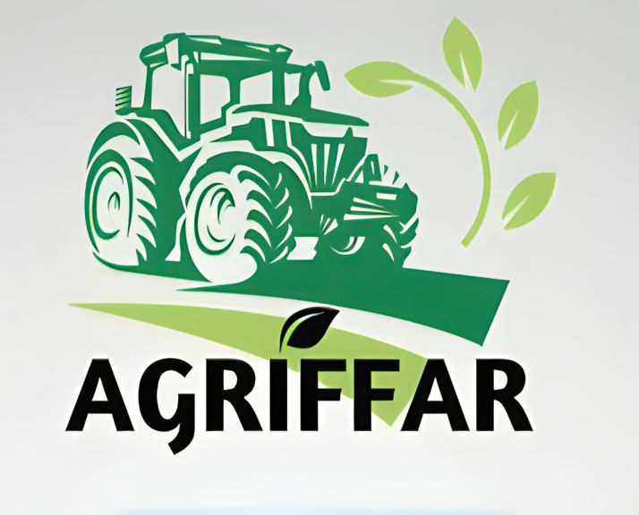

  [![MIT License][license-shield]][license-url]
  [![LinkedIn][linkedin-shield]][linkedin-url]

<a href="https://github.com/dornelesfernando/AgrIFFar/blob/main/README_pt-BR.md">

  > [!TIP]
  > Click here to read this `README.md` in **English**.
</a>

<h4 align="center"> 
    🚧  Em Construção...  🚧
</h4>

<!-- PROJECT LOGO -->
 

  

  <h3 align="center">AgrIFFar - Aplicativo Para Gerenciamento de Pequenas Propriedades Rurais</h3>

  

    Ajudando aqueles que alimentam o mundo!
     
    <a href="https://github.com/dornelesfernando/AgrIFFar"><strong>Explore os arquivos »</strong></a>
     
     
    <a href="https://agriffar.vercel.app">Visualizar Demonstração</a>
    ·
    <a href="https://github.com/dornelesfernando/AgrIFFar/issues/new?labels=bug&template=bug_report.md">Reportar Erro</a>
    ·
    <a href="https://github.com/dornelesfernando/AgrIFFar/issues/new?labels=enhancement&template=feature_request.md">Solicitar Mudança</a>
    
  

> [!NOTE]
> Para usar todos os recursos, baixe esse repositório para seu ambiente de desenvolvimento.

<!-- TABLE OF CONTENTS -->

  
Tabela de conteúdos

  <ol>
    <li><a href="#about-the-project">Sobre o Projeto</a></li>
    <li><a href="#roadmap">Roteiro</a></li>
    <!-- <li><a href="#roadmapPages">Roteiro de Páginas</a></li> -->
    <li><a href="#license">Licença</a></li>
    <li><a href="#contact">Contatos</a></li>
    <li><a href="#acknowledgments">Agradecimentos</a></li>
  </ol>

<!-- SOBRE O PROJETO -->
## Sobre o Projeto ✨ 

[![Screenshot da página inicial][product-screenshot]](https://agriffar.vercel.app/)

### Objetivo 🎯
The AgrIFFar is an innovative solution designed to meet the needs of small rural properties, providing support for agricultural management and access to precision farming technologies at an affordable cost.

### Benefícios 🌱
- Offer small producers a practical and efficient tool. 
- Monitoring activities on their farms.
- Decision-making
- Optimizing the use of natural resources.
- Reducing waste.
- Increasing productivity in a sustainable way.

### Desenvolvimento 🚜
Developed by students from the Federal Institute of Education, Science, and Technology of Farroupilha - Santo Ângelo Campus, under the coordination of Karlise Soares Nascimento, AgrIFFar reflects the institution's commitment to innovation and regional development.

(<a href="#readme-top">back to top</a>)

<!-- ROTEIRO -->
## Roteiro 📍

- [ ] Add Changelog
- [ ] Add documentation for the project
- [ ] Add comment in project code
- [ ] Multi-language Support
    - [ ] English
    - [ ] Spanish
    - [ ] Chinese

See the [open issues](https://github.com/dornelesfernando/AgrIFFar/issues) for a full list of proposed features (and known issues).

(<a href="#readme-top">back to top</a>)

<!-- ROTEIRO PAGES
## Roteiro Pages 📌

 Make a list of pages to do 
| Feature                | Status       |
|------------------------|--------------|
| Adicionar Changelog    | 🟩 Feito     |
| Suporte Multi-linguagem| 🔲 Em progresso |
| Comentários no código  | 🔲 Não iniciado |
-->

<!-- LICENSE -->
## License 📝

Distributed under the MIT License. See `LICENSE` for more information.

(<a href="#readme-top">back to top</a>)

<!-- CONTACT -->
## Contact 🌍

Fernando Dorneles - [Lattes](http://lattes.cnpq.br/0532418852427960) - [@fernandodorneles](www.linkedin.com/in/fernandodorneles) - fernandodorneles95@gmail.com

Karlise Soares - [Lattes](http://lattes.cnpq.br/6702586607871869) - karlise.nascimento@iffarroupilha.edu.br

Project Link: [https://github.com/dornelesfernando/AgrIFFar](https://github.com/dornelesfernando/AgrIFFar)

(<a href="#readme-top">back to top</a>)

<!-- ACKNOWLEDGMENTS -->
## Acknowledgments 🛠️

List of useful resources that I enjoyed using in the project:

* [Vercel](https://vercel.com/)
* [Learn React](https://react.dev/learn)
* [React Icons](https://react-icons.github.io/react-icons/search)
* [W3Schools Online Web Tutorials](https://www.w3schools.com/)
* [MDN Web Docs - Mozilla](https://developer.mozilla.org/)
* [Font Awesome](https://fontawesome.com)

(<a href="#readme-top">back to top</a>)

<!-- MARKDOWN LINKS & IMAGES -->
<!-- https://www.markdownguide.org/basic-syntax/#reference-style-links -->
[license-shield]: https://img.shields.io/github/license/othneildrew/Best-README-Template.svg?style=for-the-badge
[license-url]: https://github.com/dornelesfernando/AgrIFFar/blob/main/LICENSE
[linkedin-shield]: https://img.shields.io/badge/-LinkedIn-black.svg?style=for-the-badge&logo=linkedin&colorB=555
[linkedin-url]: https://www.linkedin.com/in/fernandodorneles
[product-screenshot]: ./images/HomePage.png