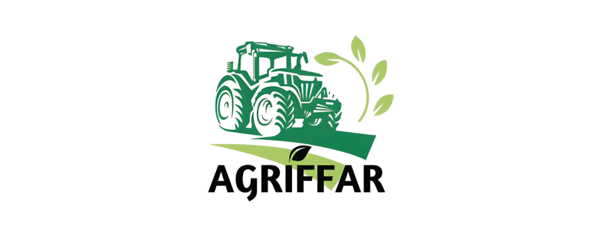
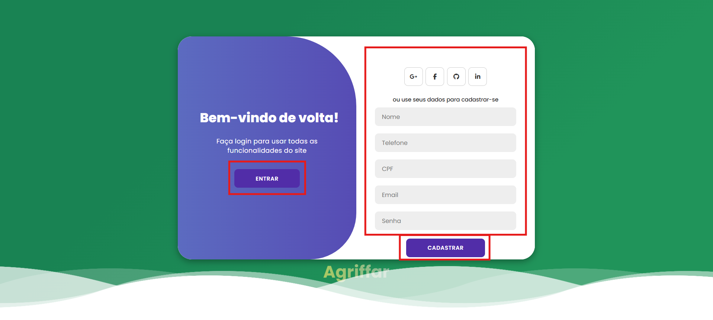
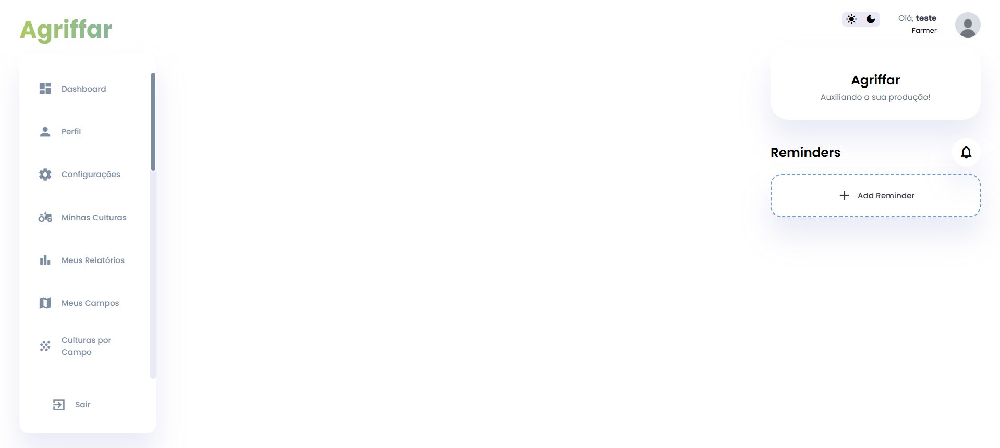

<a id="readme-top"></a>
<div align="center">

  [![MIT License][license-shield]][license-url]
  [![LinkedIn][linkedin-shield]][linkedin-url]  
  [](https://wakatime.com/badge/github/dornelesfernando/AgrIFFar)
</div>

<a href="https://github.com/dornelesfernando/AgrIFFar/blob/main/README_pt-BR.md">

  > [!TIP]
  > Click here to read this `README.md` in **English**.
</a>

<h4 align="center"> 
    🚧  Em Construção...  🚧
</h4>

<!-- PROJECT LOGO -->
<br />
<div align="center">
  <a href="https://github.com/dornelesfernando/AgrIFFar">
    
  </a>

  <h3 align="center">AgrIFFar - Aplicativo Para Gerenciamento de Pequenas Propriedades Rurais</h3>

  <p align="center">
    Ajudando aqueles que alimentam o mundo!
    <br />
    <a href="https://github.com/dornelesfernando/AgrIFFar"><strong>Explore os arquivos »</strong></a>
    <br />
    <br />
    <a href="https://agriffar.vercel.app">Visualizar Demonstração</a>
    ·
    <a href="https://github.com/dornelesfernando/AgrIFFar/issues/new?labels=bug&template=bug_report.md">Reportar Erro</a>
    ·
    <a href="https://github.com/dornelesfernando/AgrIFFar/issues/new?labels=enhancement&template=feature_request.md">Solicitar Mudança</a>
    
  </p>
</div>

> [!NOTE]
> Para usar todos os recursos, baixe esse repositório para seu ambiente de desenvolvimento.

<!-- TABLE OF CONTENTS -->
<details>
  <summary>Tabela de conteúdos</summary>
  <ol>
    <li>
      <a href="#about-the-project">Sobre o Projeto</a>
      <ul>
        <li><a href="#built-with">Constrído Com</a></li>
      </ul>
    </li>
    <li>
      <a href="#getting-started">Primeiros Passos</a>
      <ul>
        <li><a href="#prerequisites">Pré-requisitos</a></li>
        <li><a href="#installation">Instalação</a></li>
      </ul>
    </li>
    <li><a href="#usage">Uso</a></li>
    <li><a href="#roadmap">Roteiro</a></li>
    <li><a href="#roadmapPages">Roteiro de Páginas</a></li>
    <li><a href="#license">Licença</a></li>
    <li><a href="#contact">Contatos</a></li>
    <li><a href="#acknowledgments">Agradecimentos</a></li>
  </ol>
</details>


<!-- SOBRE O PROJETO -->
<a id="#about-the-project"></a>

## Sobre o Projeto ✨ 

[![Screenshot da página inicial][product-screenshot]](https://agriffar.vercel.app/)

### Objetivo 🎯
O AgrIFFar é uma solução inovadora pensada para atender às necessidades de pequenas propriedades rurais, proporcionando suporte à gestão agrícola e acesso a tecnologias de agricultura de precisão a um custo acessível.

### Benefícios 🌱
- Oferecer aos pequenos produtores uma ferramenta prática e eficiente.
- Monitorar as atividades em suas fazendas.
- Tomada de decisão
- Otimizar o uso dos recursos naturais.
- Reduzir o desperdício.
- Aumentar a produtividade de forma sustentável.

### Desenvolvimento 🚜
Desenvolvido por alunos do Instituto Federal de Educação, Ciência e Tecnologia Farroupilha - Campus Santo Ângelo, sob coordenação de Karlise Soares Nascimento, o AgrIFFar reflete o comprometimento da instituição com a inovação e o desenvolvimento regional.

<p align="right">(<a href="#readme-top">voltar ao início</a>)</p>


<!-- BUILT WITH> -->
<a id="#built-with"></a>

### Ferramentas Utilizadas 🛠️

Lista com as principais ferramentas usadas no projeto.

* [![React][React.js]][React-url]
* [![Vite][Vite.js]][Vite-url]
* [![MySQL][MySQL.com]][MySQL-url]

<p align="right">(<a href="#readme-top">voltar ao início</a>)</p>


<!-- GETTING STARTED -->
<a id="#getting-started"></a>

## Primeiros Passos 🚀

Para obter uma cópia local e executá-la, siga os seguintes passos.

### Pré-requisitos 📋
  Certifique-se de ter o seguinte instalado:

* **npm**  
  ```sh
  npm install npm@latest -g
  ```

### Instalação ⚙️

_Siga os passos para instalar e configurar seu aplicativo. Este modelo não depende de nenhuma dependência ou serviço externo._

1. Clone o repositório
   ```sh
   git clone https://github.com/dornelesfernando/AgrIFFar.git
   ```
2. Instalar pacotes NPM
   ```sh
   npm install
   ```

3. Alterar url remoto do git para evitar envios acidentais para o projeto base.
   ```sh
   git remote set-url origin dornelesfernando/AgrIFFar
   git remote -v # confirm the changes
   ```

<p align="right">(<a href="#readme-top">voltar ao início</a>)</p>


<!-- USAGE EXAMPLES -->
<a id="#usage"></a>

## Uso 🌟

### 1️. **Cadastre-se ou faça login**

O primeiro passo é criar uma conta ou fazer login se você já tiver uma. Se você não tem uma conta, clique em "Cadastrar-se" e preencha os dados. Caso já tenha uma conta, clique em "Login" e insira suas credenciais.

**Print da tela de login ou cadastro:**


---

### 2️. **Preencha os dados de cadastro ou faça login**

- **Cadastro:** Preencha todos os campos necessários para criar uma nova conta, como nome, e-mail e senha.
  
  **Print da tela de cadastro:**

  

- **Login:** Insira seu e-mail e senha para acessar sua conta existente.

  **Print da tela de login:**

  

---

### 3️. **Acesse o Dashboard**

Após completar o cadastro ou login, você será direcionado para o **Dashboard**, onde poderá visualizar e gerenciar suas informações e dados. Aqui você poderá acessar diferentes funcionalidades do sistema de forma fácil e intuitiva.

**Print do Dashboard liberado:**



<p align="right">(<a href="#readme-top">voltar ao início</a>)</p>

---

<!-- ROTEIRO -->
<a id="#roadmap"></a>

## Roteiro 📍

- [ ] Adicionar Changelog
- [ ] Adicionar documentação para o projeto
- [ ] Adicionar comentários no código do projeto
- [ ] Suporte multilíngue
  - [ ] Inglês
  - [ ] Espanhol
  - [ ] Chinês

Veja em [Problemas em aberto](https://github.com/dornelesfernando/AgrIFFar/issues) para uma lista completa de recursos propostos (e problemas conhecidos).

<p align="right">(<a href="#readme-top">voltar ao início</a>)</p>


<!-- ROTEIRO PAGES -->
<a id="#roadmapPages"></a>

## Roteiro Páginas 📌

<div align="right">
TP: Tipo de Usuário - 
  (🌐) Comum - 
  (🛡️) Administrador - 
  (🧑‍🌾) Fazendeiro 
</div>

| TP  | Página                     | Status           | - | - | TP  | Página                     | Status           |
|-----|----------------------------|------------------| - | - |-----|----------------------------|------------------|
| 🌐  | Dashboard                  | 🔲 Em progresso | - | - | 🧑‍🌾  | Culturas por Campo         | 🔲 Não iniciado |
| 🌐  | Perfil                     | 🔲 Não iniciado | - | - | 🧑‍🌾  | Colheitas por Campo        | 🔲 Não iniciado |
| 🌐  | Configurações              | 🔲 Não iniciado | - | - | 🧑‍🌾  | Tratamentos                | 🔲 Não iniciado |
|-----|----------------------------|------------------| - | - | 🧑‍🌾  | Fluxo de Caixa             | 🔲 Não iniciado |
| 🛡️  | Gerenciar Usuários         | 🔲 Não iniciado | - | - | 🧑‍🌾  | Custos                     | 🔲 Não iniciado |
| 🛡️  | Visão Geral                | 🔲 Não iniciado | - | - | 🧑‍🌾  | Depreciação                | 🔲 Não iniciado |
| 🛡️  | Equipe                     | 🔲 Não iniciado | - | - | 🧑‍🌾  | Insumos                    | 🔲 Não iniciado |
| 🛡️  | Relatórios                 | 🔲 Não iniciado | - | - | 🧑‍🌾  | Investimentos              | 🔲 Não iniciado |
| 🛡️  | Culturas                   | 🔲 Não iniciado | - | - | 🧑‍🌾  | Máquinas                   | 🔲 Não iniciado |
| 🛡️  | Campos                     | 🔲 Não iniciado | - | - | 🧑‍🌾  | Manutenção                 | 🔲 Não iniciado |
| 🛡️  | Dicas                      | 🔲 Não iniciado | - | - | 🧑‍🌾  | Plantio                    | 🔲 Não iniciado |
| 🛡️  | Pedidos Recentes           | 🔲 Não iniciado | - | - | 🧑‍🌾  | Preparação                 | 🔲 Não iniciado |
|-----|----------------------------|------------------| - | - | 🧑‍🌾  | Estoque                    | 🔲 Não iniciado |
| 🧑‍🌾  | Minhas Culturas            | 🔲 Não iniciado | - | - | 🧑‍🌾  | Dicas                      | 🔲 Não iniciado |
| 🧑‍🌾  | Meus Relatórios            | 🔲 Não iniciado | - | - | 🧑‍🌾  | Transporte                 | 🔲 Não iniciado |
| 🧑‍🌾  | Meus Campos                | 🔲 Em progresso | - | - |-----|----------------------------|------------------|

<p align="right">(<a href="#readme-top">voltar ao início</a>)</p>


<!-- LICENSE -->
<a id="#license"></a>

## Licença 📝

Distribuído sob a Licença MIT. Veja `LICENSE` para mais informações.

<p align="right">(<a href="#readme-top">voltar ao início</a>)</p>


<!-- CONTACT -->
<a id="#contact"></a>

## Contato 🌍

Fernando Dorneles - [Lattes](http://lattes.cnpq.br/0532418852427960) - [@fernandodorneles](www.linkedin.com/in/fernandodorneles) - fernandodorneles95@gmail.com

Karlise Soares - [Lattes](http://lattes.cnpq.br/6702586607871869) - karlise.nascimento@iffarroupilha.edu.br

Project Link: [https://github.com/dornelesfernando/AgrIFFar](https://github.com/dornelesfernando/AgrIFFar)

<p align="right">(<a href="#readme-top">voltar ao início</a>)</p>


<!-- ACKNOWLEDGMENTS -->
<a id="#acknowledgments"></a>

## Agradecimentos 🤝

Lista de recursos úteis que gostei de usar no projeto:

* [Vercel](https://vercel.com/)
* [Learn React](https://react.dev/learn)
* [React Icons](https://react-icons.github.io/react-icons/search)
* [W3Schools Online Web Tutorials](https://www.w3schools.com/)
* [MDN Web Docs - Mozilla](https://developer.mozilla.org/)
* [Font Awesome](https://fontawesome.com)

<p align="right">(<a href="#readme-top">voltar ao início</a>)</p>

<!-- MARKDOWN LINKS & IMAGES -->
<!-- https://www.markdownguide.org/basic-syntax/#reference-style-links -->
[license-shield]: https://img.shields.io/github/license/dornelesfernando/AgrIFFar.svg?style=for-the-badge
[license-url]: https://github.com/dornelesfernando/AgrIFFar/blob/main/LICENSE
[linkedin-shield]: https://img.shields.io/badge/-LinkedIn-black.svg?style=for-the-badge&logo=linkedin&colorB=555
[linkedin-url]: https://www.linkedin.com/in/fernandodorneles
[product-screenshot]: ./images/HomePage.png
[React.js]: https://img.shields.io/badge/React-20232A?style=for-the-badge&logo=react&logoColor=61DAFB
[React-url]: https://reactjs.org/
[Vite.js]: https://img.shields.io/badge/Vite-646CFF?style=for-the-badge&logo=Vite&logoColor=white
[Vite-url]: https://vite.dev/
[MySQL.com]: https://img.shields.io/badge/MySQL-4479A1?style=for-the-badge&logo=mysql&logoColor=white
[MySQL-url]: https://www.mysql.com/ 